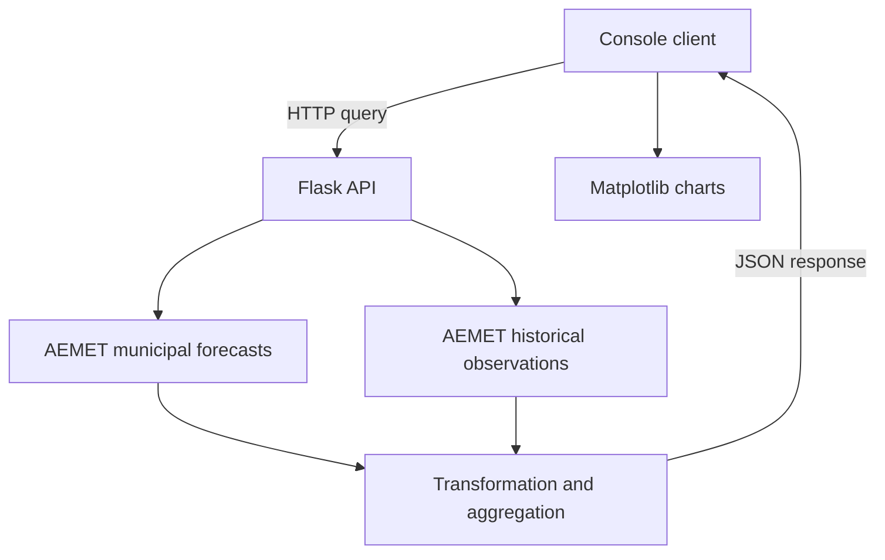

<div align="center">

# AEMET Weather API

**From weather data to a usable REST API and a visual Python client**

Python · Flask · Requests · Matplotlib

An academic client–server project by **Enrique Vicente Pujante**  
Data Science & Engineering · University of Murcia

</div>

## Overview

This project retrieves municipal forecasts and historical observations from AEMET OpenData, transforms them into a common JSON response, and exposes them through a local Flask API. A console client visualises forecast rain probability and wind values for an outdoor padel-court scenario.

The main challenge is adapting different forecast intervals and historical data formats into a response that a client can consume without repeating the upstream integration logic.

## What it demonstrates

- REST API integration, including AEMET's metadata-to-data URL flow.
- Client–server separation with Flask and Requests.
- Transformation of nested JSON, numeric strings and forecast intervals.
- Historical temperature, humidity and wind comparisons, with differences from the historical mean.
- Interactive data visualisation with Matplotlib.
- Environment-based credential configuration and basic request validation.

## Architecture



Data is processed **in memory**. There is no database, persistence or cache.

## Quick start

Use Python 3.10+ and a personal AEMET OpenData API key. Run these commands from the repository root.

```bash
python -m venv .venv
```

Activate the environment:

```powershell
# Windows PowerShell
.\.venv\Scripts\Activate.ps1
```

```bash
# macOS / Linux
source .venv/bin/activate
```

Install dependencies:

```bash
python -m pip install -r requirements.txt
```

Set the key in the **server terminal**:

```powershell
# Windows PowerShell
$env:AEMET_API_KEY="YOUR_AEMET_KEY"
python server.py
```

```bash
# macOS / Linux
export AEMET_API_KEY="YOUR_AEMET_KEY"
python server.py
```

The server listens at `http://127.0.0.1:5000`. In a second terminal, activate the environment and run:

```bash
python client.py
```

Choose a municipality and 1–7 forecast days, then select a chart. The client requires a graphical desktop. `.env.example` documents the variable; the application does **not** automatically load `.env` files. Never commit your key.

## API example

Open this URL while the server is running:

```text
http://127.0.0.1:5000/frd/data/1.0/forecast?q=murcia,ES&d=3&units=metric
```

Add `&history=1` to request historical comparison. The console client uses forecasts only; historical comparison is available through the API.

| Parameter | Default | Meaning |
| --- | --- | --- |
| `q` | Required | Municipality and country, e.g. `murcia,ES` |
| `d` | `7` | Forecast days, from 1 to 7 |
| `history` | `0` | Previous years requested, from 0 to 5 |
| `units` | `metric` | `metric` or the original coursework's `standard` mode |

Supported municipalities: **Murcia, Orihuela, Caravaca and San Javier**.

The AEMET key is configured on the server, not passed by the client. See [API details and limitations](docs/API.md) before interpreting the values, especially wind and historical dates.

## Repository guide

| File | Purpose |
| --- | --- |
| `server.py` | REST endpoint, AEMET requests and original transformation logic |
| `client.py` | Interactive forecast client and charts |
| `requirements.txt` | Runtime dependencies |
| `tests/test_server.py` | Offline endpoint and transformation checks |
| `docs/API.md` | Response schema, assumptions and limitations |
| `docs/PORTFOLIO_NOTES.md` | Provenance and changes made for publication |

## Validation

```bash
python -m unittest discover -s tests -v
```

The tests use synthetic upstream responses and require no API key or internet connection. They check request validation, interval counts, historical response fields and upstream failures. They do **not** prove compatibility with AEMET's live responses.

## Scope and next steps

This is a curated academic project, not a production weather service. The original transformation logic assumes specific AEMET array positions. Historical dates use fixed day offsets; wind units need harmonisation between forecast and historical sources. These limitations are documented rather than presented as verified capabilities.

Next steps: validate against live source schemas, align observations by calendar date, normalise wind units, handle missing observations, and add caching.

## Author

**Enrique Vicente Pujante** · [LinkedIn](https://www.linkedin.com/in/enrique-vicente-pujante/) · [GitHub](https://github.com/evicentep)

Developed for **Fundamentos de Redes de Datos**, Grado en Ciencia e Ingeniería de Datos, Universidad de Murcia. The submitted source and reports identify Enrique Vicente Pujante as author. The publication changes are recorded separately below.

## License

Code and original documentation are available under the [MIT License](LICENSE). AEMET data and third-party dependencies retain their own terms.
